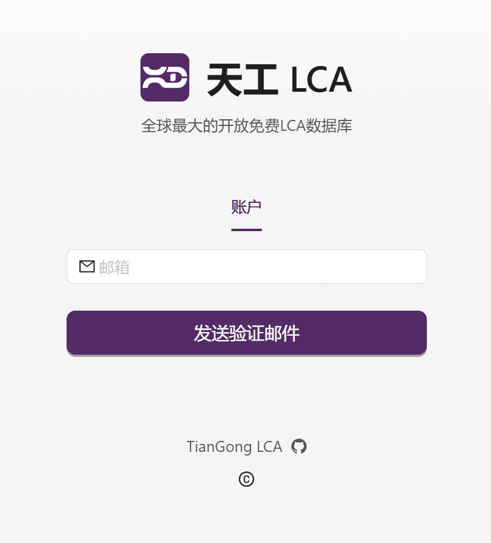

# 用户注册与登录指南

欢迎使用本指南！以下是如何快速注册新账户或登录已有账户的说明。

## 注册

还没有账户？请按以下步骤注册：

    1. 按页面提示填写必要的注册信息（如邮箱、密码等）。

    2. 点击 **注册** 按钮完成操作。

  

注册成功后，您可立即使用填写的邮箱和密码登录平台。

## 登录

已有账户的用户请按以下步骤登录：

    1. 输入邮箱和密码。

    2. 点击 **登录** 按钮进入系统。

  

首次登录后，您可以点击右上角的邮箱地址。在该位置的下拉菜单中，您将看到**账号信息**和**退出登录**选项。点击 **[账号信息](../user-guide/account-profile)**，您可以进行个性化设置。

## 忘记密码

如果您忘记密码，请按照以下步骤找回：

    1. 在登录页面点击 **忘记密码** 链接，进入找回密码页面。

    2. 输入您的注册邮箱地址，确保与账号绑定的邮箱一致。

    3. 点击 **发送验证邮件** 按钮。

  

系统将向您提供的邮箱发送一封验证邮件。请根据邮件中的指引完成密码重置。
