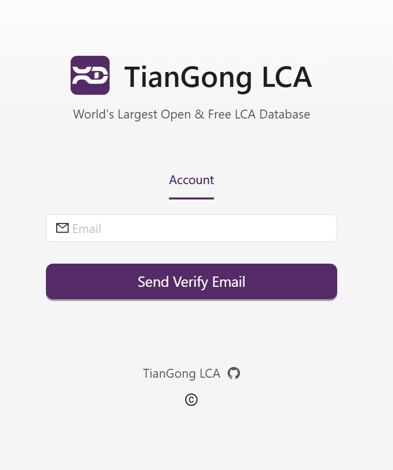

# User Sign up and Login Guide

Welcome to this guide! Below are instructions on how to quickly sign up for a new account or log in to an existing one.

## Sign up

Don’t have an account yet? Follow these steps to sign up:

    1. Fill in the required registration information (e.g., email, password, etc.) as prompted.

    2. Click the **sign up** button to complete the process.

Once sign up is successful, you can immediately log in using the email and password you provided.

## Login

If you already have an account, please follow these steps to log in:

    1. Enter your email and password.

    2. Click the **Login** button to access the system.

After your first login, you can click your email address in the upper right corner. A dropdown menu will appear with options for **Account Profile** and **Logout**. Click **[Account Profile](../user-guide/account-profile)** to customize your settings.

## Forgot Password

If you have forgotten your password, follow these steps to recover it:

    1. On the login page, click the **Forgot Password ?** link to open the password recovery page.

    2. Enter your registered email address (the one linked to your account).

    3. Click the **Send Verify Email** button.

The system will send a verification email to the address you provided. Please follow the instructions in the email to complete the password reset process.

[Download this picture](./img/forgotpwd.png)