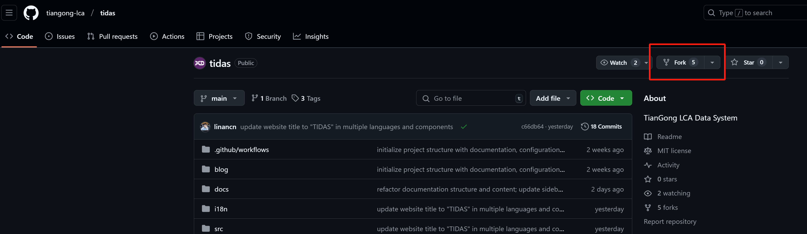

# How to Contribute to TIDAS Documentation

Welcome to contribute to TIDAS documentation! Here is the contribution process:

## 1. Fork the Project

- Visit [TIDAS GitHub page](https://github.com/tiangong-lca/tidas)
- Click the "Fork" button in the top right corner
- Select your GitHub account as the destination



## 2. Clone the Repository

```bash
git clone https://github.com/YOUR-USERNAME/tidas.git
```

You can choose between HTTPS or SSH depending on your situation. If using SSH, you need to add SSH keys to your GitHub account.


## 3. Make Changes

- Documentation files are located in the `docs/` directory
- Write documentation using Markdown syntax
- Ensure to follow existing documentation style

## 4. Commit Changes

```bash
git add .
git commit -m "Describe your changes"
git push origin your-branch-name
```

## 5. Create Pull Request (PR)

- Visit your forked GitHub repository page
- Click the "Compare & pull request" button
- Fill in the PR description, explaining your changes
- Click "Create pull request"

## 6. Code Review

- Wait for project maintainers to review your PR
- Make necessary changes based on feedback

## Contribution Guidelines

- Keep documentation concise and clear
- Follow existing format and style
- Ensure all links are valid
- Use correct Markdown syntax

Recommended to use [VS Code](../../current/faq/VSCode-guide.md) development environment

Thank you for your contribution!
